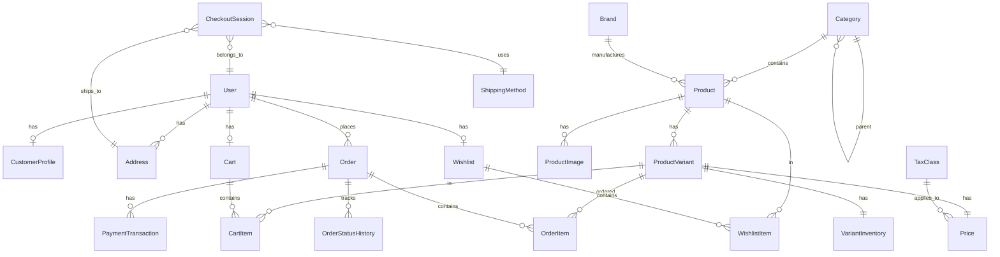

# DCL E-Commerce Backend Documentation

> **Purpose**: This document provides a comprehensive technical specification for rebuilding the Django backend. Use this as a reference when working with an AI agent to recreate the backend architecture.

---

## Table of Contents

1. [Project Setup](#project-setup)
2. [Django Apps Overview](#django-apps-overview)
3. [Models Reference](#models-reference)
4. [URL Routing](#url-routing)
5. [Key Views & Logic](#key-views--logic)
6. [Third-Party Integrations](#third-party-integrations)
7. [Database Schema Diagram](#database-schema-diagram)

---

## Project Setup

### Directory Structure

```
D:\E-commerce\
├── apps/                    # All Django apps
│   ├── accounts/            # User authentication & profiles
│   ├── cart/                # Shopping cart
│   ├── catalog/             # Products, categories, brands
│   ├── checkout/            # Checkout flow & shipping
│   ├── cms/                 # Content management (stub)
│   ├── core/                # Core utilities (stub)
│   ├── dashboard/           # Admin dashboard
│   ├── orders/              # Order management
│   ├── payments/            # Payment processing
│   ├── pricing/             # Prices & taxes
│   ├── promotions/          # Promotions (stub)
│   ├── reviews/             # Product reviews (stub)
│   ├── support/             # Customer support
│   └── wishlist/            # User wishlists
├── dcl_ecommerce/           # Project configuration
│   ├── settings/
│   │   ├── base.py          # Base settings
│   │   ├── development.py   # Development overrides
│   │   └── production.py    # Production overrides
│   ├── urls.py              # Root URL configuration
│   └── wsgi.py
├── templates/               # Global templates
├── static/                  # Static files
├── media/                   # User uploads
├── requirements.txt
└── manage.py
```

### Requirements

```txt
# Core
Django>=5.0,<5.1
django-environ>=0.11.2
django-extensions>=3.2.3
Pillow>=10.2.0

# Database
psycopg2-binary>=2.9.9      # PostgreSQL
dj-database-url>=2.1.0

# Authentication
django-allauth>=0.60.1
PyJWT>=2.8.0
cryptography>=42.0.0

# Forms
django-crispy-forms>=2.1
crispy-bootstrap5>=2024.2

# Admin
django-import-export>=3.3.6

# Security
django-cors-headers>=4.3.1

# Static Files
whitenoise>=6.6.0

# Background Tasks (optional)
celery>=5.3.6
redis>=5.0.1

# Payment Gateway
requests>=2.31.0             # For SSLCommerz API

# Production
gunicorn>=21.2.0
```

### Key Settings (`settings/base.py`)

```python
# Custom User Model
AUTH_USER_MODEL = 'accounts.User'

# Installed Apps Order
DJANGO_APPS = ['django.contrib.admin', 'django.contrib.auth', ...]
THIRD_PARTY_APPS = ['allauth', 'allauth.account', 'crispy_forms', ...]
LOCAL_APPS = [
    'apps.core', 'apps.accounts', 'apps.catalog', 'apps.pricing',
    'apps.cart', 'apps.checkout', 'apps.orders', 'apps.payments',
    'apps.promotions', 'apps.cms', 'apps.reviews', 'apps.wishlist',
    'apps.support', 'apps.dashboard'
]

# Allauth Config
ACCOUNT_LOGIN_METHODS = {'email'}
ACCOUNT_SIGNUP_FIELDS = ['email*', 'password1*', 'password2*']

# Context Processors
'apps.core.context_processors.site_settings'
'apps.cart.context_processors.cart'

# SSLCommerz
SSLCOMMERZ_STORE_ID = env('SSLCOMMERZ_STORE_ID')
SSLCOMMERZ_STORE_PASS = env('SSLCOMMERZ_STORE_PASS')
SSLCOMMERZ_SANDBOX = True  # Set False for production
```

---

## Django Apps Overview

| App          | Purpose                         | Status      |
| :----------- | :------------------------------ | :---------- |
| `accounts`   | Custom user, profile, addresses | ✅ Complete |
| `catalog`    | Products, categories, brands    | ✅ Complete |
| `pricing`    | Prices, taxes, discounts        | ✅ Complete |
| `cart`       | Session & DB cart               | ✅ Complete |
| `checkout`   | Multi-step checkout, shipping   | ✅ Complete |
| `orders`     | Order lifecycle & history       | ✅ Complete |
| `payments`   | SSLCommerz, COD                 | ✅ Complete |
| `wishlist`   | User wishlists                  | ✅ Complete |
| `dashboard`  | Admin panel views               | ✅ Complete |
| `support`    | Contact & tickets               | ✅ Complete |
| `cms`        | Static pages                    | 🚧 Stub     |
| `promotions` | Coupons, discounts              | 🚧 Stub     |
| `reviews`    | Product reviews                 | 🚧 Stub     |
| `core`       | Shared utilities                | 🚧 Stub     |

---

## Models Reference

### 1. Accounts App (`apps/accounts/models.py`)

#### User

Custom user model with email-based authentication.

| Field               | Type           | Notes                  |
| :------------------ | :------------- | :--------------------- |
| `email`             | EmailField     | **Primary identifier** |
| `username`          | CharField(150) | Optional               |
| `phone`             | CharField(20)  | Optional               |
| `is_verified_email` | BooleanField   | Default: False         |
| `is_verified_phone` | BooleanField   | Default: False         |
| `is_staff`          | BooleanField   | Admin access           |
| `is_active`         | BooleanField   | Default: True          |
| `date_joined`       | DateTimeField  |                        |

```python
class User(AbstractBaseUser, PermissionsMixin):
    objects = UserManager()
    USERNAME_FIELD = 'email'
    REQUIRED_FIELDS = []
```

#### CustomerProfile

One-to-one extension of User.

| Field                      | Type         | Notes                |
| :------------------------- | :----------- | :------------------- |
| `user`                     | OneToOne     | → User               |
| `full_name`                | CharField    |                      |
| `avatar`                   | ImageField   | upload_to='avatars/' |
| `marketing_opt_in`         | BooleanField |                      |
| `default_shipping_address` | FK           | → Address            |
| `default_billing_address`  | FK           | → Address            |

#### Address

| Field                 | Type          | Notes                        |
| :-------------------- | :------------ | :--------------------------- |
| `user`                | FK            | → User                       |
| `label`               | CharField(20) | Choices: home, office, other |
| `full_name`           | CharField     |                              |
| `phone`               | CharField     |                              |
| `country`             | CharField     | Default: 'Bangladesh'        |
| `city`                | CharField     |                              |
| `area`                | CharField     |                              |
| `address_line1`       | CharField     |                              |
| `address_line2`       | CharField     | Optional                     |
| `postal_code`         | CharField     |                              |
| `is_default_shipping` | BooleanField  | Only one per user            |
| `is_default_billing`  | BooleanField  | Only one per user            |

---

### 2. Catalog App (`apps/catalog/models.py`)

#### Category

Hierarchical product categories with self-referential parent.

| Field             | Type         | Notes                        |
| :---------------- | :----------- | :--------------------------- |
| `name`            | CharField    |                              |
| `slug`            | SlugField    | Unique, auto-generated       |
| `parent`          | FK(self)     | Nullable, related='children' |
| `description`     | TextField    |                              |
| `image`           | ImageField   | upload_to='categories/'      |
| `is_active`       | BooleanField |                              |
| `seo_title`       | CharField    |                              |
| `seo_description` | TextField    |                              |
| `sort_order`      | PositiveInt  |                              |

**Key Methods**: `get_ancestors()`, `get_all_children()`

#### Brand

| Field         | Type         | Notes               |
| :------------ | :----------- | :------------------ |
| `name`        | CharField    |                     |
| `slug`        | SlugField    | Unique              |
| `logo`        | ImageField   | upload_to='brands/' |
| `description` | TextField    |                     |
| `website`     | URLField     |                     |
| `is_active`   | BooleanField |                     |
| `is_featured` | BooleanField |                     |

#### Product

| Field               | Type           | Notes                      |
| :------------------ | :------------- | :------------------------- |
| `name`              | CharField(300) |                            |
| `slug`              | SlugField      | Unique                     |
| `product_type`      | CharField      | Choices: physical, digital |
| `category`          | FK             | → Category                 |
| `brand`             | FK             | → Brand                    |
| `short_description` | TextField      | max_length=500             |
| `description`       | TextField      |                            |
| `is_active`         | BooleanField   |                            |
| `is_featured`       | BooleanField   |                            |
| `warranty_months`   | PositiveInt    |                            |
| `seo_title`         | CharField      |                            |
| `seo_description`   | TextField      |                            |

**Key Methods**: `get_primary_image()`, `get_default_variant()`, `get_price_range()`, `is_in_stock()`

**Database Indexes**: `slug`, `is_active+is_featured`, `category`, `brand`

#### ProductImage

| Field        | Type         | Notes                    |
| :----------- | :----------- | :----------------------- |
| `product`    | FK           | → Product                |
| `image`      | ImageField   | upload_to='products/'    |
| `alt_text`   | CharField    |                          |
| `sort_order` | PositiveInt  |                          |
| `is_primary` | BooleanField | One per product enforced |

#### ProductAttribute

Defines attribute types (e.g., RAM, Storage).

| Field           | Type         | Notes                                     |
| :-------------- | :----------- | :---------------------------------------- |
| `name`          | CharField    |                                           |
| `slug`          | SlugField    | Unique                                    |
| `data_type`     | CharField    | Choices: text, int, decimal, bool, choice |
| `unit`          | CharField    | e.g., 'GB', 'GHz'                         |
| `is_filterable` | BooleanField |                                           |
| `sort_order`    | PositiveInt  |                                           |

#### ProductVariant

Specific SKU with attributes (e.g., "16GB RAM / 512GB SSD").

| Field          | Type         | Notes                      |
| :------------- | :----------- | :------------------------- |
| `product`      | FK           | → Product                  |
| `sku`          | CharField    | **Unique**                 |
| `variant_name` | CharField    |                            |
| `attributes`   | JSONField    | Flexible attribute storage |
| `barcode`      | CharField    |                            |
| `weight_kg`    | DecimalField |                            |
| `is_active`    | BooleanField |                            |

**Key Methods**: `get_display_name()`, `get_effective_price()`, `is_in_stock()`

#### VariantInventory

| Field                 | Type        | Notes            |
| :-------------------- | :---------- | :--------------- |
| `variant`             | OneToOne    | → ProductVariant |
| `stock_qty`           | PositiveInt |                  |
| `reserved_qty`        | PositiveInt |                  |
| `low_stock_threshold` | PositiveInt | Default: 5       |

**Properties**: `available_qty`, `is_low_stock`, `is_out_of_stock`

#### DigitalLicenseKey

| Field                 | Type          | Notes                       |
| :-------------------- | :------------ | :-------------------------- |
| `product`             | FK            | → Product                   |
| `variant`             | FK            | → ProductVariant (optional) |
| `key`                 | TextField     |                             |
| `is_assigned`         | BooleanField  |                             |
| `assigned_order_item` | FK            | → OrderItem                 |
| `assigned_at`         | DateTimeField |                             |

---

### 3. Pricing App (`apps/pricing/models.py`)

#### TaxClass

| Field          | Type         | Notes                 |
| :------------- | :----------- | :-------------------- |
| `name`         | CharField    |                       |
| `rate_percent` | DecimalField | e.g., 15.00           |
| `country`      | CharField    | Default: 'Bangladesh' |
| `is_default`   | BooleanField | One default enforced  |

#### Price

One-to-one with ProductVariant.

| Field        | Type         | Notes                  |
| :----------- | :----------- | :--------------------- |
| `variant`    | OneToOne     | → ProductVariant       |
| `currency`   | CharField    | Choices: BDT, USD      |
| `list_price` | DecimalField | MRP                    |
| `sale_price` | DecimalField | Optional special price |
| `cost_price` | DecimalField | Internal cost          |
| `tax_class`  | FK           | → TaxClass             |

**Properties**: `effective_price`, `is_on_sale`, `discount_percent`

**Methods**: `get_tax_amount()`, `get_price_with_tax()`

---

### 4. Cart App (`apps/cart/models.py`)

#### Cart

Database-backed cart for authenticated users.

| Field        | Type     | Notes  |
| :----------- | :------- | :----- |
| `user`       | OneToOne | → User |
| `created_at` | DateTime |        |
| `updated_at` | DateTime |        |

**Properties**: `total_quantity`, `total_price`

#### CartItem

| Field      | Type        | Notes            |
| :--------- | :---------- | :--------------- |
| `cart`     | FK          | → Cart           |
| `variant`  | FK          | → ProductVariant |
| `quantity` | PositiveInt |                  |

**Constraint**: `unique_together = ('cart', 'variant')`

**Properties**: `unit_price`, `total_price`

> **Note**: For guest users, cart is stored in session using `SessionCart` (class-based, not a model).

---

### 5. Checkout App (`apps/checkout/models.py`)

#### ShippingMethod

| Field               | Type         | Notes                   |
| :------------------ | :----------- | :---------------------- |
| `name`              | CharField    |                         |
| `description`       | TextField    |                         |
| `price`             | DecimalField |                         |
| `min_delivery_days` | PositiveInt  |                         |
| `max_delivery_days` | PositiveInt  |                         |
| `is_active`         | BooleanField |                         |
| `free_above`        | DecimalField | Free shipping threshold |
| `sort_order`        | PositiveInt  |                         |

**Methods**: `get_delivery_estimate()`, `get_price_for_amount(subtotal)`

#### CheckoutSession

Temporary storage for checkout flow.

| Field                    | Type          | Notes                              |
| :----------------------- | :------------ | :--------------------------------- |
| `session_key`            | CharField     |                                    |
| `user`                   | FK            | → User (optional)                  |
| `current_step`           | CharField     | address, shipping, payment, review |
| `shipping_address`       | FK            | → Address                          |
| `billing_address`        | FK            | → Address                          |
| `guest_email`            | EmailField    |                                    |
| `guest_phone`            | CharField     |                                    |
| `guest_shipping_address` | JSONField     |                                    |
| `guest_billing_address`  | JSONField     |                                    |
| `same_as_shipping`       | BooleanField  |                                    |
| `shipping_method`        | FK            | → ShippingMethod                   |
| `promo_code`             | CharField     |                                    |
| `customer_note`          | TextField     |                                    |
| `payment_method`         | CharField     | 'sslcommerz', 'cod'                |
| `cart_data`              | JSONField     |                                    |
| `expires_at`             | DateTimeField |                                    |

---

### 6. Orders App (`apps/orders/models.py`)

#### Order

| Field                    | Type          | Notes                                                                   |
| :----------------------- | :------------ | :---------------------------------------------------------------------- |
| `order_number`           | CharField     | Unique, auto-generated (DCL-XXXXXXXX)                                   |
| `user`                   | FK            | → User (optional for guests)                                            |
| `status`                 | CharField     | pending, confirmed, processing, shipped, delivered, cancelled, refunded |
| `payment_status`         | CharField     | pending, paid, failed, refunded                                         |
| `shipping_address`       | JSONField     | Immutable snapshot                                                      |
| `billing_address`        | JSONField     |                                                                         |
| `shipping_method_name`   | CharField     |                                                                         |
| `shipping_cost`          | DecimalField  |                                                                         |
| `estimated_delivery`     | CharField     |                                                                         |
| `subtotal`               | DecimalField  |                                                                         |
| `tax_amount`             | DecimalField  |                                                                         |
| `discount_amount`        | DecimalField  |                                                                         |
| `total`                  | DecimalField  |                                                                         |
| `guest_email`            | EmailField    |                                                                         |
| `guest_phone`            | CharField     |                                                                         |
| `promo_code`             | CharField     |                                                                         |
| `customer_note`          | TextField     |                                                                         |
| `admin_note`             | TextField     |                                                                         |
| `payment_method`         | CharField     |                                                                         |
| `payment_transaction_id` | CharField     |                                                                         |
| `paid_at`                | DateTimeField |                                                                         |
| `tracking_number`        | CharField     |                                                                         |
| `shipped_at`             | DateTimeField |                                                                         |
| `delivered_at`           | DateTimeField |                                                                         |

**Database Indexes**: `order_number`, `status`, `user+created_at`

**Methods**: `get_email()`, `get_shipping_address_display()`, `calculate_totals()`

#### OrderItem

| Field           | Type         | Notes                       |
| :-------------- | :----------- | :-------------------------- |
| `order`         | FK           | → Order                     |
| `variant`       | FK           | → ProductVariant (nullable) |
| `product_name`  | CharField    | Snapshot                    |
| `variant_name`  | CharField    | Snapshot                    |
| `sku`           | CharField    | Snapshot                    |
| `product_image` | URLField     | Snapshot                    |
| `quantity`      | PositiveInt  |                             |
| `unit_price`    | DecimalField |                             |
| `total_price`   | DecimalField | Auto-calculated on save     |
| `is_digital`    | BooleanField |                             |
| `download_url`  | URLField     |                             |
| `license_key`   | TextField    |                             |

#### OrderStatusHistory

| Field        | Type      | Notes   |
| :----------- | :-------- | :------ |
| `order`      | FK        | → Order |
| `status`     | CharField |         |
| `note`       | TextField |         |
| `created_by` | FK        | → User  |

---

### 7. Payments App (`apps/payments/models.py`)

#### PaymentMethod

Configuration for available payment methods.

| Field          | Type         | Notes                             |
| :------------- | :----------- | :-------------------------------- |
| `name`         | CharField    |                                   |
| `code`         | CharField    | Unique, e.g., 'sslcommerz', 'cod' |
| `description`  | TextField    |                                   |
| `instruction`  | TextField    | Shown to customer                 |
| `logo`         | ImageField   |                                   |
| `is_active`    | BooleanField |                                   |
| `is_test_mode` | BooleanField |                                   |
| `settings`     | JSONField    | API keys, store IDs, etc.         |
| `sort_order`   | PositiveInt  |                                   |

#### PaymentTransaction

| Field                | Type         | Notes                                                     |
| :------------------- | :----------- | :-------------------------------------------------------- |
| `transaction_id`     | CharField    | Unique, UUID default                                      |
| `order`              | FK           | → Order                                                   |
| `amount`             | DecimalField |                                                           |
| `currency`           | CharField    | Default: 'BDT'                                            |
| `payment_method`     | CharField    |                                                           |
| `provider_reference` | CharField    | SSLCommerz val_id/bank_tran_id                            |
| `status`             | CharField    | pending, processing, success, failed, cancelled, refunded |
| `provider_response`  | JSONField    | Full response for audit                                   |

#### WebhookEvent

| Field           | Type         | Notes |
| :-------------- | :----------- | :---- |
| `provider`      | CharField    |       |
| `event_type`    | CharField    |       |
| `payload`       | JSONField    |       |
| `processed`     | BooleanField |       |
| `error_message` | TextField    |       |

---

### 8. Wishlist App (`apps/wishlist/models.py`)

#### Wishlist

| Field  | Type     | Notes  |
| :----- | :------- | :----- |
| `user` | OneToOne | → User |

#### WishlistItem

| Field      | Type     | Notes      |
| :--------- | :------- | :--------- |
| `wishlist` | FK       | → Wishlist |
| `product`  | FK       | → Product  |
| `added_at` | DateTime |            |

**Constraint**: `unique_together = ('wishlist', 'product')`

---

## URL Routing

### Root URLs (`dcl_ecommerce/urls.py`)

```python
urlpatterns = [
    path('admin/', admin.site.urls),
    path('', include('apps.core.urls')),                 # Homepage
    path('accounts/', include('allauth.urls')),          # Auth
    path('profile/', include('apps.accounts.urls')),     # User profile
    path('catalog/', include('apps.catalog.urls')),      # Products
    path('cart/', include('apps.cart.urls')),            # Cart
    path('checkout/', include('apps.checkout.urls')),    # Checkout
    path('orders/', include('apps.orders.urls')),        # Orders
    path('payments/', include('apps.payments.urls')),    # Payments
    path('wishlist/', include('apps.wishlist.urls')),    # Wishlist
    path('reviews/', include('apps.reviews.urls')),      # Reviews
    path('support/', include('apps.support.urls')),      # Support
    path('manage/', include('apps.dashboard.urls')),     # Admin dashboard
    path('pages/', include('apps.cms.urls')),            # CMS pages
]
```

---

## Key Views & Logic

### Checkout Flow (`apps/checkout/views.py`)

Multi-step checkout with these views:

| View                 | URL Pattern                         | Purpose                           |
| :------------------- | :---------------------------------- | :-------------------------------- |
| `checkout`           | `/checkout/`                        | Redirect to first incomplete step |
| `checkout_address`   | `/checkout/address/`                | Step 1: Address entry/selection   |
| `checkout_shipping`  | `/checkout/shipping/`               | Step 2: Shipping method           |
| `checkout_payment`   | `/checkout/payment/`                | Step 3: Payment method            |
| `checkout_review`    | `/checkout/review/`                 | Step 4: Review & place order      |
| `place_order`        | `/checkout/place/`                  | POST: Create order                |
| `order_confirmation` | `/checkout/confirm/<order_number>/` | Success page                      |

### Order Placement Logic

```python
def place_order(request):
    # 1. Get checkout session
    # 2. Create Order with address snapshots
    # 3. Create OrderItems from cart
    # 4. Apply promo code discount
    # 5. Clear cart
    # 6. If SSLCommerz: redirect to payment gateway
    # 7. If COD: redirect to confirmation
```

---

## Third-Party Integrations

### SSLCommerz Payment Gateway

**Location**: `apps/payments/utils.py` → `SSLCommerzProvider` class

**Flow**:

1. User selects SSLCommerz at checkout
2. Order is created with `payment_status='pending'`
3. Redirect to SSLCommerz payment page
4. On success, webhook/callback updates order
5. `payment_status` → 'paid', `status` → 'confirmed'

**Webhook Endpoints**:

- Success: `/payments/sslcommerz/success/`
- Fail: `/payments/sslcommerz/fail/`
- Cancel: `/payments/sslcommerz/cancel/`
- IPN: `/payments/sslcommerz/ipn/`

### Django Allauth

Handles:

- Email-based registration
- Login/Logout
- Password reset
- Email verification
- Google OAuth (optional)

---

## Database Schema Diagram



---

## How to Rebuild with an Agent

1. **Create Django Project**:

   ```bash
   django-admin startproject dcl_ecommerce .
   ```

2. **Create Apps in Order** (due to dependencies):

   ```bash
   mkdir apps
   cd apps
   django-admin startapp core
   django-admin startapp accounts
   django-admin startapp catalog
   django-admin startapp pricing
   django-admin startapp cart
   django-admin startapp checkout
   django-admin startapp orders
   django-admin startapp payments
   django-admin startapp wishlist
   django-admin startapp reviews
   django-admin startapp promotions
   django-admin startapp cms
   django-admin startapp support
   django-admin startapp dashboard
   ```

3. **Create Models** in this order (due to ForeignKey dependencies):
   1. `accounts.User`, `accounts.CustomerProfile`, `accounts.Address`
   2. `catalog.Category`, `catalog.Brand`, `catalog.Product`, `catalog.ProductImage`, `catalog.ProductAttribute`, `catalog.ProductVariant`, `catalog.VariantInventory`, `catalog.DigitalLicenseKey`
   3. `pricing.TaxClass`, `pricing.Price`
   4. `cart.Cart`, `cart.CartItem`
   5. `checkout.ShippingMethod`, `checkout.CheckoutSession`
   6. `orders.Order`, `orders.OrderItem`, `orders.OrderStatusHistory`
   7. `payments.PaymentMethod`, `payments.PaymentTransaction`, `payments.WebhookEvent`
   8. `wishlist.Wishlist`, `wishlist.WishlistItem`

4. **Run Migrations**:

   ```bash
   python manage.py makemigrations
   python manage.py migrate
   ```

5. **Create Superuser**:
   ```bash
   python manage.py createsuperuser
   ```

---

## Summary

This e-commerce backend provides:

- **Custom User Model** with email-based authentication
- **Full Product Catalog** with categories, brands, variants, and inventory
- **Flexible Pricing** with sales prices, taxes, and currency support
- **Cart System** supporting both session (guests) and database (users)
- **Multi-Step Checkout** with address, shipping, and payment selection
- **Order Management** with status tracking and history
- **Payment Integration** with SSLCommerz and Cash on Delivery
- **Wishlist** functionality for logged-in users

Use this document as a reference to rebuild or extend the backend architecture.
